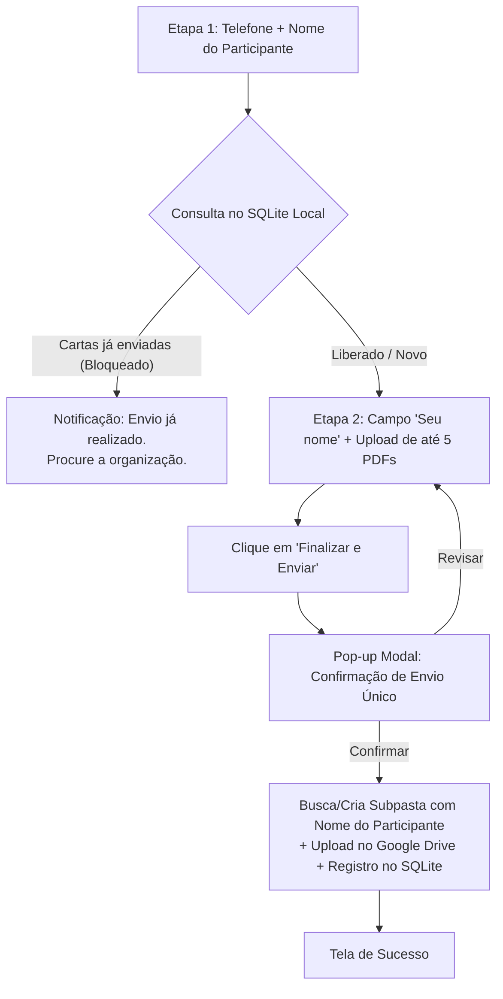

# 📖 Contexto e Propósito do Projeto — Envio de Cartas Legendários

## 🎯 1. Propósito e Objetivo do Projeto

O **Sistema de Envio de Cartas dos Servos Legendários** é uma plataforma web moderna, tática e segura desenvolvida para facilitar a coleta descentralizada de cartas de apoio em formato PDF enviadas por esposas, mães, familiares e entes queridos para os participantes do evento **Legendários**.

### Objetivos Principais:
1. **Facilidade de Envio**: Permitir que familiares enviem até 5 cartas em formato PDF por participante através de um formulário em 2 etapas simples e responsivo.
2. **Organização por Subpastas no Google Drive**: Armazenar os arquivos diretamente em uma subpasta nomeada com o **Nome do Participante** dentro da pasta principal do Google Drive.
3. **Regra de Envio Único**: Garantir a integridade da etapa do evento limitando o envio a **um único envio por número de participante**, evitando envios duplicados acidentais.
4. **Gestão, Exclusão e Reenvio (`/admin`)**: Disponibilizar um **Painel de Administração** onde a equipe do evento pode acompanhar os envios, acessar as cartas no Google Drive, **excluir registros e cartas** do sistema e, quando necessário, **habilitar um novo envio** para um participante específico.

---

## 🏗️ 2. Arquitetura e Stack Tecnológica

- **Framework Fullstack**: Next.js 15 (App Router) + React 19 + TypeScript.
- **Design System**: Tailwind CSS 3.4 no padrão **Tema Claro Tático (Light Mode)** dos Servos Legendários (Cores: `#f3f4f6` fundo, `#ffffff` superfícies, `#111827` texto primário, `#d97706` acentos amarelados/dourados táticos).
- **Banco de Dados Local**: **SQLite** via **Prisma 6 ORM** (`prisma/data/legendarios.db`) para persistência de dados de participantes, cartas e status de bloqueio.
- **Armazenamento na Nuvem**: **Google Drive API v3** (Suporta OAuth2 Refresh Token para Gmail Pessoal ou Service Account em Drive Compartilhado).
- **Containerização & Deploy**: Docker Multi-stage standalone configurado para hospedagem no **Easypanel** com volume persistente no caminho `/app/prisma/data`.

---

## 🔄 3. Fluxo de Funcionamento do Usuário (Wizard em 2 Etapas)



---

## 🔑 4. Painel de Controle do Administrador (`/admin`)

- **Acesso**: `http://localhost:3000/admin`
- **Autenticação Padrão**: Usuário `admin` | Senha `legendarios123` (definida via `ADMIN_PASSWORD` no `.env`).
- **Recursos**:
  - Tabela com busca em tempo real por participante ou telefone.
  - Links diretos para visualizar e abrir cada carta em PDF no Google Drive.
  - Data e hora exata da submissão.
  - **Botão "Habilitar Novo Envio"**: Altera a flag `isUnlocked = true` no banco SQLite, liberando um novo envio para o número.
  - **Botão de Lixeira "Excluir Registro"**: Apaga o participante e suas cartas do banco SQLite e **remove os arquivos PDF do Google Drive**.

---

## 📁 5. Estrutura de Arquivos e Pastas

```
envio-cartas/
├── contexto.md               # Este documento de contexto e instrução do projeto
├── service-account.json      # Credenciais da Service Account do Google Drive (Opcional se usar OAuth)
├── .env                      # Variáveis de ambiente (GOOGLE_DRIVE_FOLDER_ID, OAUTH, etc.)
├── Dockerfile                # Build Docker standalone para Easypanel
├── docker-compose.yml        # Orquestração local com volume do SQLite
├── next.config.ts            # Configuração Next.js standalone
├── prisma/
│   ├── schema.prisma         # Schema do SQLite (Participant e Carta)
│   └── data/                 # Pasta contendo legendarios.db (Volume persistente)
└── src/
    ├── app/
    │   ├── admin/page.tsx                  # Dashboard de Administração (Com Exclusão)
    │   ├── api/
    │   │   ├── admin/cartas/route.ts       # API de listagem do Admin
    │   │   ├── admin/delete/route.ts       # API de exclusão de participante e arquivos no Drive
    │   │   ├── admin/login/route.ts        # API de autenticação do Admin
    │   │   ├── admin/unlock/route.ts       # API de liberação de reenvio
    │   │   ├── cartas/upload/route.ts      # API de upload para subpasta no Google Drive & SQLite
    │   │   ├── participante/buscar/route.ts # API de verificação local de participante
    │   │   └── test-drive/route.ts        # API de diagnóstico do Google Drive
    │   ├── globals.css                     # Estilos Tailwind CSS do Tema Claro Tático
    │   ├── layout.tsx                      # Root Layout com fontes Outfit e Inter
    │   └── page.tsx                        # Página principal (Formulário e Sucesso)
    ├── components/
    │   ├── CartaForm.tsx                   # Componente interativo em 2 etapas
    │   ├── Header.tsx                      # Cabeçalho da aplicação Servos Legendários
    │   └── SuccessView.tsx                 # Tela de confirmação pós-envio
    └── lib/
        ├── db.ts                           # Instância singleton do Prisma Client
        ├── ghl.ts                          # Cliente de integração GoHighLevel
        ├── storage.ts                      # Handler do Google Drive API (Subpastas)
        └── utils.ts                        # Utilitários e máscara de telefone
```
